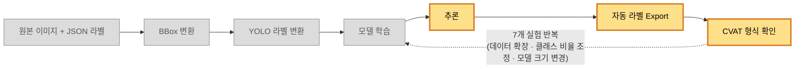
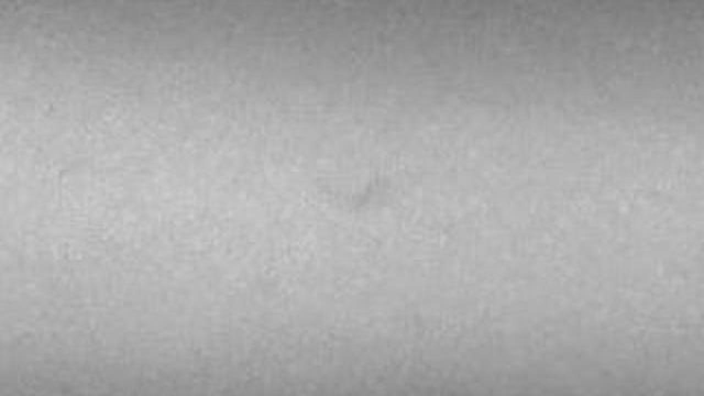

# 오토 라벨링 PoC 라이브 데모
## 목적 
AI-Hub의 용접 검사 데이터를 통해 이미지의 결함 라벨링을 학습시키고,
학습된 AI에 이미지를 넣었을 때 자동으로 라벨을 달아주는지를 검증

## 사용 데이터 
[AI - HUB](https://aihub.or.kr/aihubdata/data/view.do?pageIndex=1&currMenu=115&topMenu=100&srchOptnCnd=OPTNCND001&searchKeyword=%EC%9A%A9%EC%A0%91&srchDetailCnd=DETAILCND001&srchOrder=ORDER001&srchPagePer=20&aihubDataSe=data&dataSetSn=71761)


## 목표
특정 성능 수치를 맞추는 게 아니라,
원본 데이터 변환부터 학습, 추론, 자동 라벨 생성까지 
전체 파이프라인이 실제로 재현 가능하게 동작하는지를 확인

## 파이프라인 다이어그램



1. 원본 이미지·라벨을 정리
2. YOLO 형식으로 변환
3. 모델 학습
4. 그 모델로 추론
5. 나온 결과를 자동 라벨 형태로 내보내고
6. 실제 라벨링 검수 툴(CVAT)에 넣었을 때도 문제없이 들어가는지까지 확인

※ 이 과정을 7번의 실험에 걸쳐 반복하면서, 데이터를 늘려보고, 클래스 비율을 조정해보고, 모델 크기를 바꿔보는 식으로 검증


## 사용한 학습 데이터 샘플


```
//  Object Detection 사각형(BBox) 형태로 바꾼다. 
{
    "info": { 
        "id": 14488212,
        "type": "RT",
        "material": "AL"
    },
    "image_data": {
        "file_name": "RT_AL_02_14488212",
        "format": "jpg",
        "information": "기공",
        "width": 1280,
        "height": 720
    },
    "meta": {
        "is_crowd": 0,
        "annotation_case": [
            "porosity"
        ],
        "total_case": [
            "porosity"
        ]
    },
    "annotations": [
        {
            "tool": "polygon",
            "coordinate": {
                "x": [
                    680,
                    653,
                    645,
                    633,
                    632,
                    651,
                    670,
                    695,
                    704,
                    705
                ],
                "y": [
                    314,
                    332,
                    341,
                    363,
                    380,
                    389,
                    389,
                    367,
                    351,
                    322
                ]
            },
            "class": "defect",
            "case": "porosity"
        }
    ]
}
```

```
// YOLO가 읽을 수 있는 정규화된 숫자 네 개(중심 x, 중심 y, 너비, 높이)로 다시 변환
3 0.522266 0.488194 0.057031 0.104167
```

위와 같은 정보
학습에 482장, 검증에 85장, 테스트에 84장 사용.


## 실행 순서

1. `python src/model/exp5/run_inference.py`
2. `python src/visualization/exp5/visualize_prediction.py`
3. `python demo/compare_gt_prediction.py`

## 케이스별 확인

### 케이스 1
성공 사례
### 케이스 2
애매한 성공 사례
### 케이스 3
모델이 완전히 놓친 미탐 사례
### 케이스 4
예측 박스가 정답보다 폭·높이 모두 작은 위치 오류 사례


## 지표 요약
| 실험 | Precision(정밀도) | Recall(재현율) | mAP50(IoU 0.5 기준 평균 정밀도) | mAP50-95(IoU 0.5~0.95 기준 평균 정밀도) | porosity Recall(기공 재현율) | slag_inclusion Recall(슬래그 혼입 재현율) |
| --- | --- | --- | --- | --- | --- | --- |
| EXP-001 (Baseline) | 0.675 | 0.188 | 0.175 | 0.043 | 0.143 | 0.233 |
| EXP-002 (imgsz 960) | 0.678 | 0.238 | 0.201 | 0.075 | 0.143 | 0.333 |
| EXP-003 (box gain 확대, 폐기) | 0.433 | 0.151 | 0.118 | 0.044 | 0.036 | 0.267 |
| EXP-004 (데이터 확장) | 0.798 | 0.239 | 0.210 | 0.082 | 0.298 | 0.179 |
| **EXP-005 (Train slag_inclusion 오버샘플링, 최종 채택)** | **0.535** | **0.446** | **0.342** | **0.131** | **0.405** | **0.487** |
| EXP-006 (CLAHE, 폐기) | 0.544 | 0.350 | 0.295 | 0.103 | 0.262 | 0.359 |
| EXP-007 (모델 크기 확대, 미채택) | 0.621 | 0.293 | 0.210 | 0.089 | 0.321 | 0.179 |

- 최종적으로 채택한 다섯 번째 실험 결과
- 정밀도 0.535, 재현율 0.446, 평균 정밀도 0.342, 단계별 평균 정밀도 0.131
- 클래스별 :  기공 재현율(Recall) 0.405, 슬래그 혼합 재현율(Recall) 0.487

- 처음 베이스라인 mAP50 0.175 -> 0.342 상승 시킴(데이터 늘리기, 클래스 비율 맞추기)
- box loss 키우기, 이미지 대비 강조하기, 모델 크기 키우기 -> 실패 및 트레이드 오프

## [한계 & 다음 단계]
박스 정밀도 문제 미해결
- 학습 데이터 올리기
- CPU 환경 -> GPU 환경으로 전환

현재 수준으로는 완전 자동화는 무리
모델이 결함 후보를 표시해주고 사람이 전수 검수. 수정하는 보조 도구로 시작

파이프 라인 전체 재현 가능 -> MVP 진행.


## 라이브 실행 시 유의점

- 세 스크립트(`run_inference.py`, `visualize_prediction.py`, `compare_gt_prediction.py`) 모두 venv(`venv/Scripts/python.exe`)로 실행해야 한다(시스템 python에는 `cv2`, `ultralytics` 등이 없음 — 리허설 중 동일 문제로 한 번 막혔다).
- 한글 로그가 콘솔에서 깨지면 `PYTHONIOENCODING=utf-8` 환경변수를 설정하고 실행할 것(리허설에서 확인됨).
- `visualize_prediction.py`는 CVAT 구조 검증까지 포함해 마지막에 "전체 통과 여부: PASS" 로그를 출력한다 — 발표 중 이 로그가 뜨는 순간이 "자동 라벨 생성 흐름이 실제로 안정적으로 재현된다"는 것을 보여주는 핵심 포인트이므로 놓치지 말고 짚어줄 것.
- `compare_gt_prediction.py`는 `demo/comparison-images/`와 `demo/prediction-only-images/`에 있는 기존 4개 파일을 실행할 때마다 덮어쓴다 — 매번 새로 생성되는 게 맞고, 케이스 목록(`DEMO_CASES`)이 고정돼 있어 항상 같은 4개 파일명(`case1_`~`case4_`)으로 나온다.
- **반드시 `visualize_prediction.py`를 먼저 실행한 뒤 `compare_gt_prediction.py`를 실행해야 한다** — `compare_gt_prediction.py`가 `outputs/EXP-P1-DET-005/auto-label-visualization/`에서 예측 전용 이미지를 복사해오는데, 순서를 거꾸로 하면 그 시점엔 원본이 아직 없어서 "예측 전용 이미지 파일이 없습니다" 에러 로그가 남고 `demo/prediction-only-images/`가 갱신되지 않는다(GT vs 예측 비교 이미지는 이 경우에도 정상 생성된다).
- 세 스크립트 다 수 초 내 종료하지만(리허설 기준 `run_inference.py` 약 6초, `visualize_prediction.py` 약 1.4초, `compare_gt_prediction.py` 1초 미만), 혹시 서버·환경 문제로 라이브 실행 자체가 안 될 경우를 대비해 `demo/backup-if-live-fails/`(리허설 때 만들어둔 비교 이미지 4장 + 실행 로그 3개)를 열어둘 수 있게 준비해 갈 것. **이 폴더는 라이브가 정말 안 될 때만 열고, 정상 진행되면 사용하지 않는다** — 자세한 안내는 `demo/backup-if-live-fails/README.md` 참고.


## 관련 산출물

- 데이터 준비 현황 예시(원본 이미지·JSON 라벨·YOLO 라벨): `demo/data-sample/`(원본 복사본) — `README.md` 참고
- 4개 케이스 원본 이미지: `demo/original-images/`(원본은 `data/processed/dataset_v3/images/test/`에서 복사, 발표 편의용 고정 복사본 — 원본 데이터 자체는 수정하지 않음)
- 4개 케이스 예측 전용 이미지: `demo/prediction-only-images/` — `compare_gt_prediction.py`가 `outputs/EXP-P1-DET-005/auto-label-visualization/`에서 이 4개만 골라 실행할 때마다 자동으로 복사해온다(`comparison-images`와 동일하게 매번 갱신됨)
- GT vs 예측 비교 이미지: `demo/comparison-images/` — 라이브 데모 중 `compare_gt_prediction.py` 실행 결과가 매번 여기 생성된다(고정된 파일명 4개, 실행할 때마다 덮어씀). 발표 전에는 비어 있거나 이전 실행 결과가 남아 있을 수 있다.
- 라이브 실패 시 백업: `demo/backup-if-live-fails/`(비교 이미지 4장 + 실행 로그 3개, 리허설 시점 고정본) — `README.md` 참고
- 비교 이미지 생성 스크립트: `demo/compare_gt_prediction.py`
- 코드 리뷰: `agent_work/review.md`
