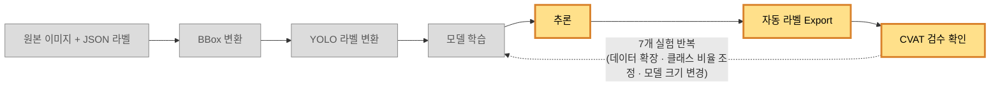

# 오토 라벨링 PoC 라이브 데모 시나리오

내부 기술팀 대상, 라이브 데모(실시간 추론 실행), 15~20분.

## 준비물

- 터미널(프로젝트 루트, venv 활성화 상태 — `venv/Scripts/python.exe` 사용)
- 이미지 뷰어 3벌을 바로 열 수 있게 준비: ① 원본(`demo/original-images/`) ② 예측 전용(`demo/prediction-only-images/`) ③ GT vs 예측 비교(`demo/comparison-images/`). 4개 케이스 파일명이 세 폴더에 동일하게(`case1_`~`case4_` 접두사) 존재하니 찾을 때 헤매지 않는다
- 화면 공유 시 최종보고서(`docs/reports/15_poc_final_report.md`) 12절 성능 표를 바로 띄울 수 있게 준비

## 파이프라인 다이어그램

## 실행 순서

1. `python src/model/exp5/run_inference.py`
2. `python src/visualization/exp5/visualize_prediction.py`
3. `python demo/compare_gt_prediction.py`

## 라이브 실행 시 유의점

- 세 스크립트(`run_inference.py`, `visualize_prediction.py`, `compare_gt_prediction.py`) 모두 venv(`venv/Scripts/python.exe`)로 실행해야 한다(시스템 python에는 `cv2`, `ultralytics` 등이 없음 — 리허설 중 동일 문제로 한 번 막혔다).
- 한글 로그가 콘솔에서 깨지면 `PYTHONIOENCODING=utf-8` 환경변수를 설정하고 실행할 것(리허설에서 확인됨).
- `visualize_prediction.py`는 CVAT 구조 검증까지 포함해 마지막에 "전체 통과 여부: PASS" 로그를 출력한다 — 발표 중 이 로그가 뜨는 순간이 "자동 라벨 생성 흐름이 실제로 안정적으로 재현된다"는 것을 보여주는 핵심 포인트이므로 놓치지 말고 짚어줄 것.
- `compare_gt_prediction.py`는 `demo/comparison-images/`와 `demo/prediction-only-images/`에 있는 기존 4개 파일을 실행할 때마다 덮어쓴다 — 매번 새로 생성되는 게 맞고, 케이스 목록(`DEMO_CASES`)이 고정돼 있어 항상 같은 4개 파일명(`case1_`~`case4_`)으로 나온다.
- **반드시 `visualize_prediction.py`를 먼저 실행한 뒤 `compare_gt_prediction.py`를 실행해야 한다** — `compare_gt_prediction.py`가 `outputs/EXP-P1-DET-005/auto-label-visualization/`에서 예측 전용 이미지를 복사해오는데, 순서를 거꾸로 하면 그 시점엔 원본이 아직 없어서 "예측 전용 이미지 파일이 없습니다" 에러 로그가 남고 `demo/prediction-only-images/`가 갱신되지 않는다(GT vs 예측 비교 이미지는 이 경우에도 정상 생성된다).
- 세 스크립트 다 수 초 내 종료하지만(리허설 기준 `run_inference.py` 약 6초, `visualize_prediction.py` 약 1.4초, `compare_gt_prediction.py` 1초 미만), 혹시 서버·환경 문제로 라이브 실행 자체가 안 될 경우를 대비해 `demo/backup-if-live-fails/`(리허설 때 만들어둔 비교 이미지 4장 + 실행 로그 3개)를 열어둘 수 있게 준비해 갈 것. **이 폴더는 라이브가 정말 안 될 때만 열고, 정상 진행되면 사용하지 않는다** — 자세한 안내는 `demo/backup-if-live-fails/README.md` 참고.

## 케이스 선정 근거

`reports/evaluation/EXP-P1-DET-005/error_cases.csv`, `predictions/EXP-P1-DET-005/prediction_results.json`, `data/processed/dataset_v3/labels/test/*.txt`를 대조해 선정했다. 이미지 전체가 오탐 없이 깔끔한 "오탐 단독" 케이스는 찾지 못해(대부분 다른 GT 박스와 섞여 있음) 4건으로 확정했다.

| 케이스 | 원본 파일명(`case{N}_` 접두사 붙이기 전) | 케이스 |
| --- | --- | --- |
| 1 | `RT_AL_02_14489691.jpg` | 성공: porosity 2건 모두 정확히 검출 (IoU 0.83, 0.7대) |
| 2 | `RT_AL_05_14492165.jpg` | 성공: slag_inclusion 정확히 검출 (IoU 0.80) |
| 3 | `RT_AL_02_14488212.jpg` | 실패(미탐): Small porosity 놓침 |
| 4 | `RT_AL_05_14492954.jpg` | 실패(위치 오류): 예측 박스가 GT보다 작게 그려짐 |

## 관련 산출물

- 데이터 준비 현황 예시(원본 이미지·JSON 라벨·YOLO 라벨): `demo/data-sample/`(원본 복사본) — `README.md` 참고
- 4개 케이스 원본 이미지: `demo/original-images/`(원본은 `data/processed/dataset_v3/images/test/`에서 복사, 발표 편의용 고정 복사본 — 원본 데이터 자체는 수정하지 않음)
- 4개 케이스 예측 전용 이미지: `demo/prediction-only-images/` — `compare_gt_prediction.py`가 `outputs/EXP-P1-DET-005/auto-label-visualization/`에서 이 4개만 골라 실행할 때마다 자동으로 복사해온다(`comparison-images`와 동일하게 매번 갱신됨)
- GT vs 예측 비교 이미지: `demo/comparison-images/` — 라이브 데모 중 `compare_gt_prediction.py` 실행 결과가 매번 여기 생성된다(고정된 파일명 4개, 실행할 때마다 덮어씀). 발표 전에는 비어 있거나 이전 실행 결과가 남아 있을 수 있다.
- 라이브 실패 시 백업: `demo/backup-if-live-fails/`(비교 이미지 4장 + 실행 로그 3개, 리허설 시점 고정본) — `README.md` 참고
- 비교 이미지 생성 스크립트: `demo/compare_gt_prediction.py`
- 코드 리뷰: `agent_work/review.md`
